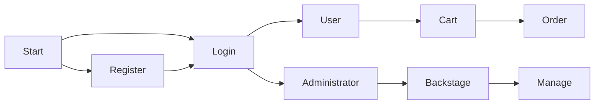
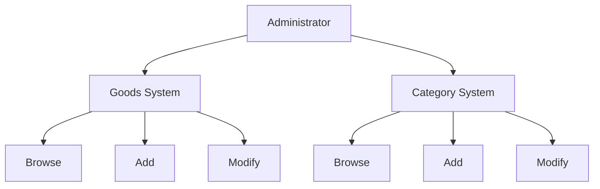
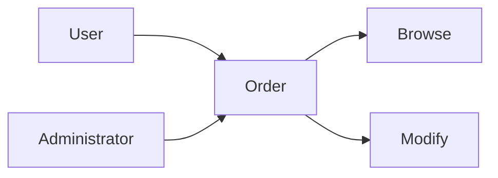
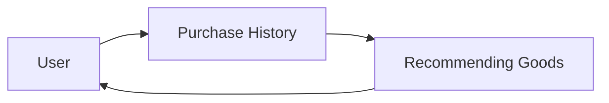
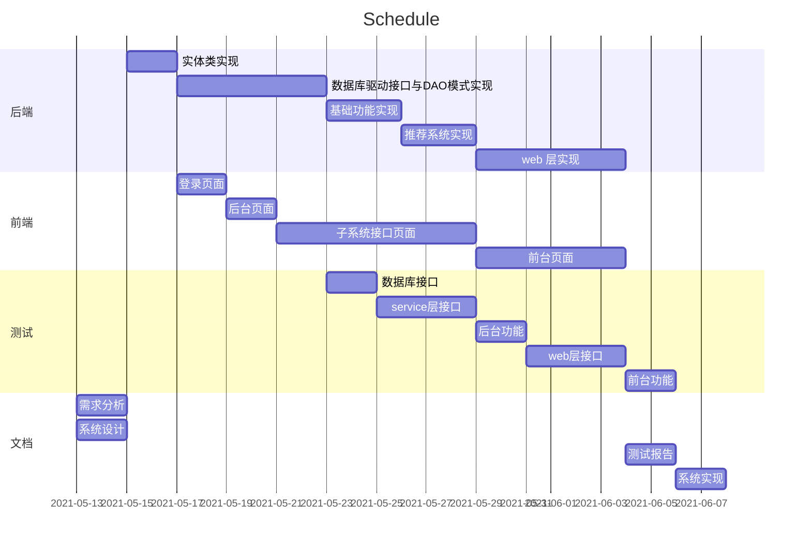
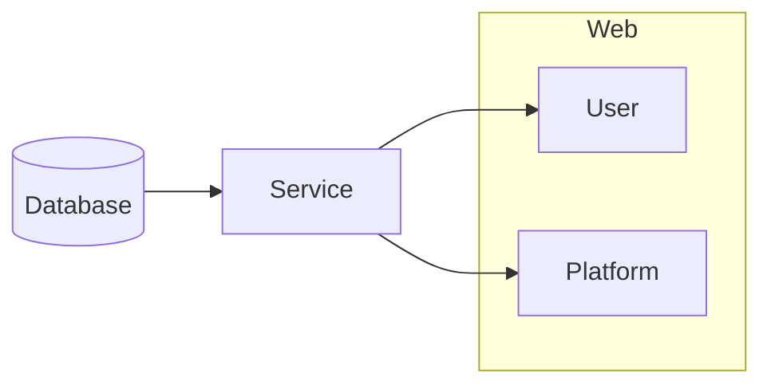
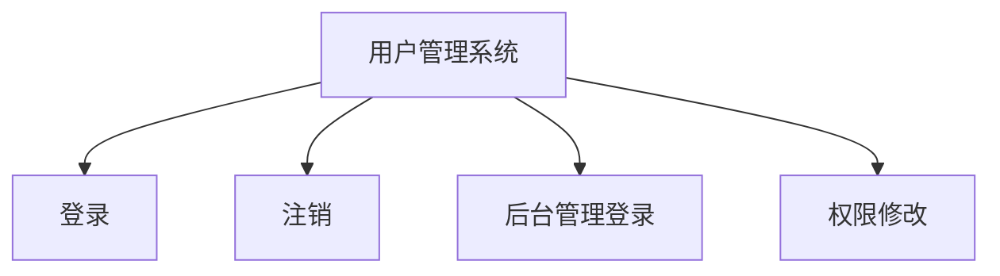
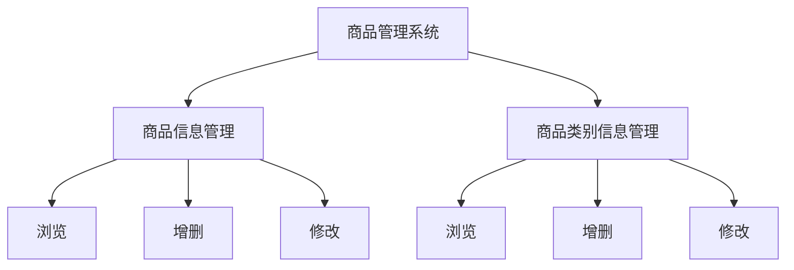
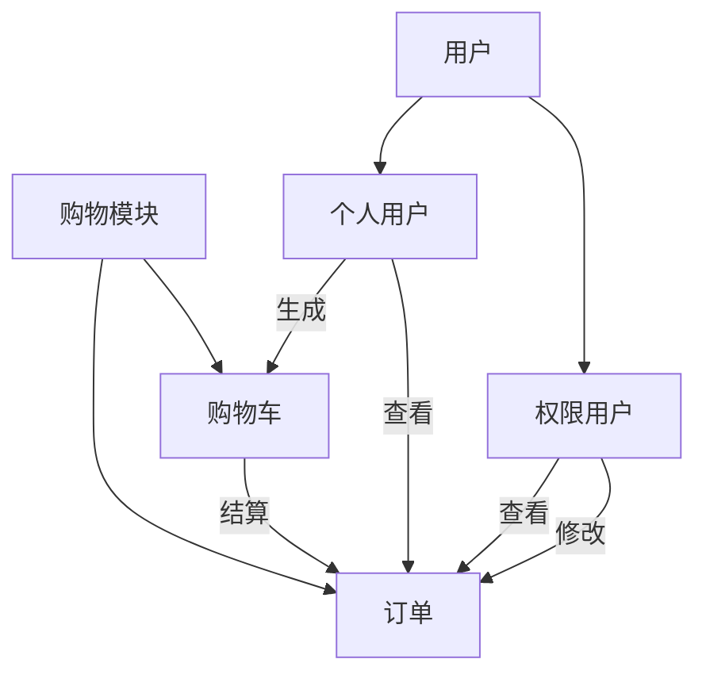
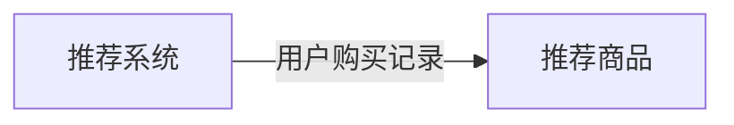

# 《网络应用开发》报告

<center>
    学院：计算机科学与工程
    <br>
    班级：18 网络工程
    <br>
    姓名：姚靖龙
    <br>
    学号：201836590363
    <br>
    科目：网络应用开发
    <br>
    指导老师：布社辉
</center>

# 《网络应用开发》需求分析报告


[TOC]

## 1. 引言

### 1.1 编写目的

本项目为简易现代电子商务系统，同时能够满足基于大数据的数据分析模块。

本文档的为该系统的需求分析文档，目的是为了解决系统开发过程中的所需的需求分析。

### 1.2 项目背景

本项目为现代电子商务系统，它剧本有现代商业网站所必备的基于大数据的数据分析模块和推荐系统。

## 2. 需求概述

### 2.1 原始需求

- 基础功能
  - 使用角色对系统的登录、注册、注销；
  - 管理员角色对用户的浏览与修改；
  - 用户角色对商品的浏览、查询、购买以及订单的生成；
  - 销售人员对商品、以及商品类别的管理，对订单的修改和浏览；
- 大数据与推荐系统模块
  - 用户对商品购买的记录；
  - 日志文件的生成与操作；
  - 对用户购买趋势的预测；
  - 向用户推送推荐的商品；

### 2.2 用户特点

本系统的用户为个人和电商平台。

- 个人用户通过本系统可以浏览、购买商品，并查询订单信息；
- 电商平台通过本系统可以建立一个面向用户的网上销售渠道、一个统一组织的商品管理系统，并通过系统的推荐模块预测用户的需求。

### 2.3 系统目的

该系统的目的在于：

- 对于个人用户，在满足电商业务的基本需求，如购买、浏览等功能外，利用推荐系统提高个人用户购买和浏览时的用户体验；
- 对于电商平台，在满足电商业务的基本需求，如管理商品信息、管理用户与订单信息外，利用推荐系统最大程度地提高销售量，并留住用户。

## 3. 分析场景

### 3.1 用户系统

#### 3.1.1 系统分析

1. 用户在操作系统前需要进行登录，向登录接口提供用户名和密码；
2. 若用户不存在账号，则需要通过注册接口；
3. 对于登录后的个人用户，开放购买、结算生成购物车的权限；
4. 对于登录后的非个人用户可以通过后台接口进入后台管理系统；
5. 对于权限用户，在基础权限上，提供对所有用户的修改权限；
6. 对于权限用户，提供对商品相关信息的修改权限；

#### 3.1.2 业务流程图



### 3.2 商品系统

#### 3.2.1 系统分析

1. 对于权限用户，提供商品的查看、添加、修改功能；
2. 对于权限用户，提供商品列表的查看、添加、修改功能；

#### 3.2.2 业务流程图



### 3.3 订单系统

#### 3.3.1 系统分析

1. 对于个人用户，提供对自己订单的查询的接口，包括历史订单；
2. 对于权限用户，提供对所有订单的查询、修改接口；

#### 3.3.2 业务流程图



### 3.4 推荐系统

#### 3.4.1 系统分析

1. 对于个人用户，收集其购买信息；
2. 根据购买信息建立数据分析模块；
3. 根据数据分析模块的结论，对个人用户提供商品推荐；

#### 3.4.2 业务流程图



## 4. 功能实例化

### 4.1 登录注册模块

#### 4.1.1 子模块功能描述

- 对于登录部分，根据用户提供的账户信息进行查询，返回相关的信息，如登录成功的挑战、登录失败的提示等；
- 对于注册模块，根据用户提供的注册信息进行查询，返回相关的信息，如注册成功的挑战、用户名重复的提示等；

#### 4.1.2 子模块验收准则

- 正常实现上述功能，响应时间小于 100ms；

### 4.2 商品购买模块

#### 4.2.1 子模块功能描述

- 个人用户可以通过浏览商品信息对商品进行添加至购物车的操作，支持重复购买；
- 个人用户可以通过购物车接口查看购物车，支持结算生成订单的操作；
- 个人用户可以通过查看订单接口，查看已完成和未完的订单信息；

#### 4.2.2 子模块验收准则

- 正常实现上述功能，响应时间小于 100ms；

### 4.3 商品管理模块

#### 4.3.1 子模块功能描述

- 权限用户可以通过商品信息查询接口查询全部商品信息；
- 权限用户可以通过类别信息查询接口查询全部类别信息；
- 权限用户可以通过商品信息添加接口添加任意符合格式的商品信息；
- 权限用户可以通过类别信息添加接口添加任意符合格式的类别信息；
- 权限用户可以通过商品信息修改接口修改系统中的商品信息；
- 权限用户可以通过类别信息修改接口修改系统中的类别信息；
- 权限用户可以通过订单查询接口查询系统中的订单信息；
- 权限用户可以通过订单修改接口修改系统中的订单信息；

#### 4.3.2 子模块验收准则

- 正常实现上述功能，响应时间小于 100ms；
- 针对网络不稳定等突发情况，数据库能够保证操作结果的正确性；

### 4.4 用户管理模块

#### 4.4.1 子模块功能描述

- 权限用户可以通过用户查看接口查询系统中所有权限小于等于自己的用户信息；
- 高级权限用户可以通过用户修改接口修改系统中所有权限小于自己的用户信息；

#### 4.4.2 子模块验收准则

- 正常实现上述功能，响应时间小于 100ms；
- 针对网络不稳定等突发情况，数据库能够保证操作结果的正确性；

### 4.5 大数据与推荐模块

#### 4.5.1 子模块功能描述

- 对于个人用户，收集数据分析所需要的信息；
- 对于个人用户，根据其相关的数据进行分析，推荐可能需要的商品；

#### 4.5.2 子模块验收准则

- 对于不同行为的用户，体现出推荐系统行为的不同；
- 准确记录相关用户行为日志，从数据分析的角度合理地进行推荐；

## 5. 时间安排和其他

系统实现的重点应放在大数据与推荐模块的算法设计与分析上。



---

# 《网络应用开发》系统设计报告

[TOC]

## 1. 设计标准

### 1.1 系统功能

本系统为一个现代电子商务系统。主要提供给个人用户和电商平台使用，以实现网上商品的购买、订单追踪、平台管理、商品推荐等功能。通过本系统可以对相关的信息载体进行录入、变更、查找、审核等操作，按使用者的身份及任务划分权限让不同身份的用户明确自己的工作任务，同时也可以利用系统内置的修改身份权限设置来重组业务流程，以满足系统用户的需求。

### 1.2 系统效率

本系统采用基于Web的图形化页面进行操作，简单快捷，方便上手。同时在网络环境稳定的情况下可以高效率、高响应切正确地操作系统数据。

### 1.3 系统可靠性

本系统通过数据库模块的设计，使得数据可以正确地在数据库上进行修改。

### 1.4 系统可变更性

本系统结构简单，采用MVC和DAO组合的设计模式，利用Java面向对象的特性实现，各个组件之间分工明确互不干扰；对于系统功能的升级、添加和删除都可以通过修改或增加组件的方式实现，充分体现了系统的灵活性。

### 1.5 系统兼容性

本系统采用 Java8、Maven3.6 以及 Tomcat9 作为开发以及运行环境。支持在 Windows 和 Linux 系统下部署。

## 2. 平台设计

### 2.1 整体设计

本系统采用 MVC 架构进行设计，主要包含四个部分：数据库、服务端、电商平台客户端、个人用户客户端。客户端通过服务端对数据库进行访问，增加安全性。



层与层之间提供单向可调用的接口，使得不同层的业务在逻辑上独立开来，方便管理以及后续的扩展。

### 2.2 系统平台设计要求

- 易于上手；
- 容易进行扩展和维护；
- 操作简单，不需要额外的知识储备；
- 技术完善；

### 2.3 系统软件要求

- 使用VS Code作为开发工具；
- 使用MySQL8.0作为后台数据库管理系统；
- 使用Tomcat9.0作为服务器；
- 使用Maven3.6作为包管理；
- JDK8.0

## 3. 模块与模块内部功能规划

### 3.1 用户管理模块

用于管理用户信息和账户登录注销以及权限信息的模块。



### 3.2 商品管理模块

商品管理模块提供了后台权限用户对商品的管理。该模块主要包含了两个部分，分别是商品信息和商品类别信息，二者具有类似的功能。



### 3.3 购物模块

购物模块分为两个部分，一个是购物车部分，一个是订单部分。前者面向个人用户开放，后者部分功能面向个人用户开放，主要面向电商平台用户开放。



### 3.4 推荐模块

该模块通过针对用户的购买信息，根据算法生成推荐商品。



## 4. 数据库逻辑结构设计

以下为数据库的表设计，其中id为主键，是利用java的UUID工具生成的随机字符串。

- category(id, name, description)：商品类别对应的表
- goods(id, name, description, price, category_id)：商品对应的表
- user(id, name, password, email, address)：用户对应的表
- orders(id, time, state, total_price, user_id)：订单信息对应的表
- orderitem(id, goods_id, number, total_price, order_id)：订单日志对应的表
- manager(id, username)：权限用户对应的表
- logs(id, userid, goods_id, num)：购买记录对应的表
- correlation(id, goods1_id, goods2_id, correlation)：用于进行推荐的大数据对应的表

## 5. 推荐系统原理设计

本系统采用基于物品相关度的协同过滤算法进行推荐。通过维护物品间的相关度，对用户购买的物品信息进行分析，从而推荐相关的物品。

实现的过程中要考虑维护物品相关度的代价，尽可能快速的更新相关度信息，提高用户体验。同时也要考虑相关度评估的方式。

---

# 《网络应用开发》系统实现报告

[TOC]

## 1. 实现与分析

### 1.1 DAO

DAO部分的实现都是按照数据库查询、相关信息计算、数据库更新、返回结果的顺序完成的，这里只提供接口信息，方便阅读。

#### 1.1.1 用户

```java
public interface DAOUser {
    void add(User user);
    void remove(User user);
    User find(String id);
    User find(String name, String password);
    void setManager(User user);
    void unsetManager(User user);
    boolean isManager(String id);
}
```

该接口定义了对用户信息的修改和查询接口，提供给service层进行调用。

#### 1.1.2 商品与类别

```java
public interface DAOGoods {
    void add(Goods goods);
    void remove(Goods goods);
    void update(Goods goods);
    Goods find(String id);
    List<Goods> getAll();
    QueryResult query(String condition);
    Goods getMVG(User user);
    List<Goods> getRecommend(Goods goods);
}
```

该接口定义了商品信息的修改与查询接口，提供给service层调用。

```java
public interface DAOCategory {
    void add(Category category);
    void remove(Category category);
    Category find(String id);
    List<Category> getAll();
}
```

该接口定义了商品类别信息的修改与查询接口，提供给service层调用。

#### 1.1.3 订单

```java
public interface DAOOrder {
    void add(Order order);
    Order find(String id);
    List<Order> getAll(boolean status);
    void update(String id, boolean status);
    List<Order> getAll(User user, boolean status);
    void addLog(Order order);
}
```

该接口定义了订单信息的修改与查询接口，提供给service层调用。

### 1.2 Service

#### 1.2.1 用户管理模块

用户管理模块通过调用相关的DAO接口完成操作，逻辑结构简单，这里只展示相关接口。

```java
public interface BusinessService {
    /*...*/
    void addUser(User user);
    void removeUser(User user);
    User findUser(String id);
    User findUser(String username, String password);
    boolean isManager(String id);
    void setManager(User user);
    void unsetManager(User user);
    /*...*/
}
```

#### 1.2.2 商品管理模块

商品管理模块通过调用相关的DAO接口完成操作，逻辑结构简单，这里只展示相关接口。

```java
public interface BusinessService {
    /*...*/
    void addCategory(Category category);
    void removeCategory(Category category);
    Category findCategory(String id);
    List<Category> getAllCategory();
    void addGoods(Goods goods);
    void removeGoods(Goods goods);
    void updateGoods(Goods goods);
    Goods findGoods(String id);
    List<Goods> getAllGoods();
    List<Goods> goodsQuery(QueryHeader header);
    /*...*/
}
```

#### 1.2.3 购物模块

购物模块的接口如下：

```java
public interface BusinessService {
    /*...*/
    void createOrder(ShoppingCart cart, User user);
    Order findOrder(String id);
    List<Order> findOrder(boolean state);
    void updateOrder(String id, boolean status);
    List<Order> findOrder(String id, boolean state);
    /*...*/
}
```

这里给出订单创建功能的实现：

```java
@Override
public void createOrder(ShoppingCart cart, User user) {
    Order order = new Order();
    order.setID(UUID.randomUUID().toString());
    order.setDate(new SimpleDateFormat("yyyy-MM-dd hh:mm:ss").format(new Date()));
    order.setTotalPrice(cart.getTotalPrice());
    order.setStatus(false);
    order.setUser(user);

    Set<OrderItem> orderItems = new HashSet<OrderItem>();
    Set<Map.Entry<String, CartItem>> set = cart.getItems().entrySet();
    for (Map.Entry<String, CartItem> entry : set) {
        CartItem cartItem = entry.getValue();
        OrderItem orderItem = new OrderItem();
        orderItem.setGoods(cartItem.getGoods());
        orderItem.setID(UUID.randomUUID().toString());;
        orderItem.setTotalPrice(cartItem.getTotalPrice());
        orderItem.setNumber(cartItem.getNumber());

        orderItems.add(orderItem);
    }
    order.setItems(orderItems);
    orderDAO.add(order);
    orderDAO.addLog(order);
}
```

`addLog` 部分会更新订单信息对物品相关度的维护，这一内容放在推荐部分详细讲解。

#### 1.2.4 推荐模块

推荐系统采用了基于物品的协同过滤算法。

相关性系数通过用户的购买记录来维护。假设同一订单内的物品和不同订单内的物品相关性不一样，前者相关性更高。那么可以维护一个相关性系数矩阵，评估物品间的相关性系数。初始的时候两个商品的相关性是 0。当用户完成购买的时候会生成一个订单，考虑基于该订单更新相似度。一个订单内的物品两两之间会对相关性系数贡献
$$
\rm \frac{Num_i \times Num_j}{N^2} \times (1 + \frac{[category_i == category_j]}{category\ num})
$$
其中 N 为购买的总物品量。

该式的本质是一个对余弦相似度的优化，一方面考虑到了类别信息对商品的影响，另一方面，该式不需要计算整个余弦相似度。

首先相似度矩阵很显然是一个稀疏矩阵，每次更新只会对其中部分项产生影响，因此不需要先计算出余弦相似度，转而使用遍历订单信息更新两两之间的贡献值才是效率最高的做法。同时这也减少了代码量。

推荐的时候只需要根据用户以往的购买信息，获取经常购买的商品和最近购买的商品，再计算出与这些商品相似度最高的商品列表进行推荐即可。

该算法同时具有一定的扩展性，由于要维护的矩阵式稀疏矩阵，可以先进行SVD分解后再计算相关性，提升速度。并且可以根据商品的描述，计算得到词向量，在相似度的基础上结合商品描述的词向量的距离进行相似度模型的计算，更准确的分析出商品本质上的相似性。同时，可以提取商品描述中的关键词，通过存储用户常购买物品的关键词进行检索，在基于物品的相似度的基础上提升针对用户的个性化推荐。

```java
@Override
public List<Goods> recommend(User user) {
    Goods goods = goodsDAO.getMVG(user);
    if (goods == null)
        return goodsDAO.getAll();
    return goodsDAO.getRecommend(goods);
}
```

`getRecommend` 函数通过对相关性矩阵排序得到对应的列表。

`addLog` 函数通过计算信息对数据库进行更新从而维护相似度矩阵。

### 1.3 Servlet

该部分展示主要功能的处理。

#### 1.3.1 注册

```java
protected void doGet(HttpServletRequest request, HttpServletResponse response)
    throws ServletException, IOException {
    try {
        User user = new User();
        user.setID(UUID.randomUUID().toString());
        user.setName(request.getParameter("username"));
        user.setPassword(request.getParameter("password"));
        user.setEmail(request.getParameter("email"));
        user.setAddress(request.getParameter("address"));
        if (user.getID() != null && user.getName() != null && user.getPassword() != null && user.getEmail() != null
            && user.getAddress() != null) {
            service.addUser(user);
            request.getRequestDispatcher("/jsps/client/login.jsp").forward(request, response);
        } else {
            request.setAttribute("message", "注册失败");
            request.getRequestDispatcher("/jsps/message.jsp").forward(request, response);
        }
    } catch (Exception e) {
        e.printStackTrace();
        request.setAttribute("message", "注册失败");
        request.getRequestDispatcher("/jsps/message.jsp").forward(request, response);
    }
}
```

#### 1.3.2 订单创建

```java
private void create(HttpServletRequest request, HttpServletResponse response) throws ServletException, IOException {
    try {
        ShoppingCart cart = (ShoppingCart) request.getSession().getAttribute("cart");
        User user = (User) request.getSession().getAttribute("user");
        if (cart.getItems().size() > 0) {
            service.createOrder(cart, user);
            request.getSession().removeAttribute("cart");
            request.getRequestDispatcher("/index.jsp").forward(request, response);
        } else {
            request.setAttribute("message", "购物车空，无法创建订单");
            request.getRequestDispatcher("/jsps/message.jsp").forward(request, response);
        }
    } catch (Exception e) {
        e.printStackTrace();
        request.setAttribute("message", "订单创建失败");
        request.getRequestDispatcher("/jsps/message.jsp").forward(request, response);
    }
}
```

#### 1.3.3 登录

```java
protected void doGet(HttpServletRequest request, HttpServletResponse response)
    throws ServletException, IOException {
    try {
        String username = request.getParameter("username");
        String password = request.getParameter("password");
        User user = service.findUser(username, password);
        if (user == null) {
            request.setAttribute("message", "登陆失败，检查账号密码");
            request.getRequestDispatcher("/jsps/message.jsp").forward(request, response);
        } else {
            request.getSession().setAttribute("user", user);
            request.getRequestDispatcher("/pre-load.jsp").forward(request, response);
        }
    } catch (Exception e) {
        e.printStackTrace();
        request.setAttribute("message", "登录失败");
        request.getRequestDispatcher("/jsps/message.jsp").forward(request, response);
    }
}
```

#### 1.3.4 后台登录

```java
protected void doGet(HttpServletRequest request, HttpServletResponse response)
    throws ServletException, IOException {
    try {
        User user = (User) request.getSession().getAttribute("user");
        if (user == null || service.isManager(user.getID()) == false) {
            request.setAttribute("message", "权限不足，无法进入后台");
            request.getRequestDispatcher("/jsps/message.jsp").forward(request, response);
        } else {
            request.getRequestDispatcher("/jsps/admin/bms.jsp").forward(request, response);
        }
    } catch (Exception e) {
        e.printStackTrace();
        request.setAttribute("message", "权限不足，无法进入后台");
        request.getRequestDispatcher("/jsps/message.jsp").forward(request, response);
    }
}
```

#### 1.3.5 商品推荐列表

```java
protected void doGet(HttpServletRequest request, HttpServletResponse response)
    throws ServletException, IOException {
    try {
        String category_id = request.getParameter("category_id");
        List<Goods> goodslist = null;
        if (category_id != null && category_id.trim().equals("") == false) {
            QueryHeader header = new QueryHeader();
            header.setQueryName("category_id");
            header.setQueryValue(category_id);
            goodslist = service.goodsQuery(header);
        }
        else {
            User user = (User) request.getSession().getAttribute("user");
            goodslist = service.recommend(user);
        }
        List<Category> categories = service.getAllCategory();
        request.setAttribute("preload_goodslist", goodslist);
        request.setAttribute("preload_categories", categories);
        request.getRequestDispatcher("/index.jsp").forward(request, response);
    } catch (Exception e) {
        e.printStackTrace();
        request.setAttribute("message", "信息加载失败");
        request.getRequestDispatcher("/jsps/message.jsp").forward(request, response);
    }
}
```

#### 1.3.6 添加用户

```java
private void add(HttpServletRequest request, HttpServletResponse response) throws ServletException, IOException {
    try {
        User user = new User();
        user.setID(UUID.randomUUID().toString());
        user.setName(request.getParameter("name"));
        user.setPassword(request.getParameter("password"));
        user.setEmail(request.getParameter("email"));
        user.setAddress(request.getParameter("address"));
        service.addUser(user);
        if ("S".equals(request.getParameter("permission"))) {
            service.setManager(user);
        }
        request.setAttribute("message", "添加成功");
    } catch (Exception e) {
        e.printStackTrace();
        request.setAttribute("message", "添加失败");
    }
    request.getRequestDispatcher("/jsps/message.jsp").forward(request, response);
}
```

添加商品等功能类似，这里不多做展示。

#### 1.3.7 删除类别

```java
private void remove(HttpServletRequest request, HttpServletResponse response) throws ServletException, IOException {
    try {
        Category category = service.findCategory(request.getParameter("cid"));
        service.removeCategory(category);
        getAll(request, response);
    } catch (Exception e) {
        e.printStackTrace();
        request.setAttribute("message", "无法删除，请检查该分类下是否有商品");
        request.getRequestDispatcher("/jsps/message.jsp").forward(request, response);
    }
}
```

删除商品等功能类似，这里不多做展示。

## 2. 开发环境、在线部署与源码

### 2.1 配置文件与环境

本项目采用 VS Code 作为开发环境，使用 Maven3.6 进行包管理。

Maven配置文件如下

```xml
<?xml version="1.0" encoding="UTF-8"?>

<project xmlns="http://maven.apache.org/POM/4.0.0" xmlns:xsi="http://www.w3.org/2001/XMLSchema-instance"
  xsi:schemaLocation="http://maven.apache.org/POM/4.0.0 http://maven.apache.org/xsd/maven-4.0.0.xsd">
  <modelVersion>4.0.0</modelVersion>

  <groupId>da</groupId>
  <artifactId>DAStore</artifactId>
  <version>0.1</version>
  <packaging>war</packaging>

  <name>DAStore Maven Webapp</name>

  <properties>
    <project.build.sourceEncoding>UTF-8</project.build.sourceEncoding>
    <maven.compiler.source>8</maven.compiler.source>
    <maven.compiler.target>8</maven.compiler.target>
  </properties>

  <dependencies>
    <dependency>
        <groupId>org.apache.commons</groupId>
        <artifactId>commons-collections4</artifactId>
        <version>4.4</version>
    </dependency>

    <dependency>
        <groupId>javax.servlet</groupId>
        <artifactId>javax.servlet-api</artifactId>
        <version>3.1.0</version>
        <scope>provided</scope>
    </dependency>


    <dependency>
      <groupId>commons-dbutils</groupId>
      <artifactId>commons-dbutils</artifactId>
      <version>1.7</version>
    </dependency>


    <dependency>
      <groupId>mysql</groupId>
      <artifactId>mysql-connector-java</artifactId>
      <version>8.0.22</version>
    </dependency>

    <dependency>
      <groupId>com.sun.commons</groupId>
      <artifactId>beanutils</artifactId>
      <version>1.6.1-20070314</version>
    </dependency>

    <dependency>
      <groupId>jetty</groupId>
      <artifactId>jsp-api</artifactId>
      <version>2.1-6.0.2</version>
    </dependency>

    <dependency>
      <groupId>junit</groupId>
      <artifactId>junit</artifactId>
      <version>4.11</version>
      <scope>test</scope>
    </dependency>
  </dependencies>

  <build>
    <finalName>DAStore</finalName>
    <pluginManagement><!-- lock down plugins versions to avoid using Maven defaults (may be moved to parent pom) -->
      <plugins>
        <plugin>
          <artifactId>maven-clean-plugin</artifactId>
          <version>3.1.0</version>
        </plugin>
        <!-- see http://maven.apache.org/ref/current/maven-core/default-bindings.html#Plugin_bindings_for_war_packaging -->
        <plugin>
          <artifactId>maven-resources-plugin</artifactId>
          <version>3.0.2</version>
        </plugin>
        <plugin>
          <artifactId>maven-compiler-plugin</artifactId>
          <version>3.8.0</version>
        </plugin>
        <plugin>
          <artifactId>maven-surefire-plugin</artifactId>
          <version>2.22.1</version>
        </plugin>
        <plugin>
          <artifactId>maven-war-plugin</artifactId>
          <version>3.2.2</version>
        </plugin>
        <plugin>
          <artifactId>maven-install-plugin</artifactId>
          <version>2.5.2</version>
        </plugin>
        <plugin>
          <artifactId>maven-deploy-plugin</artifactId>
          <version>2.8.2</version>
        </plugin>
      </plugins>
    </pluginManagement>
  </build>
</project>

```

### 2.2 部署

通过mvn package命令将项目打包成 .war 文件，将该包放置到tomcat/webapps路径下，并在conf/server.xml中添加该包的信息（路径，包名，接口），运行startup即可。

### 2.3 源码和在线网站

可登录http://106.52.76.120:8083/ 查看。测试权限账号为 root，密码为 haha2333。

源代码见 [Trees-D/DAStore (github.com)](https://github.com/Trees-D/DAStore)

## 3. 总结

本系统主要在上学期的课设的基础上增加大数据部分，由于大数据部分涉及到未曾学习过的知识，因为我查阅了相关的资料。目前大多数的电商系统的推荐模块都采用了类似协同过滤的推荐算法，绝大多数不同在于使用了不同的比较模型。除了基于物品的相似度模型外，基于人群的相似度模型也是常用的做法之一。但由于本系统用户数据较少，因此使用基于物品的相似度模型进行计算。推荐系统的总体方案都符合预期。

在这次课设中，我学习了当前主流的大数据推荐的算法，对推荐系统和数据分析都有了新的认识。

---

# 《网络应用开发》测试报告

[TOC]

## 注册


注册后成功登录。

## 购买


成功购买并生成订单。

## 推荐


购买后推荐商品和购买的商品相关。

## 添加和查看商品分类

 


## 添加和查看商品


## 添加管理员


## 订单管理


