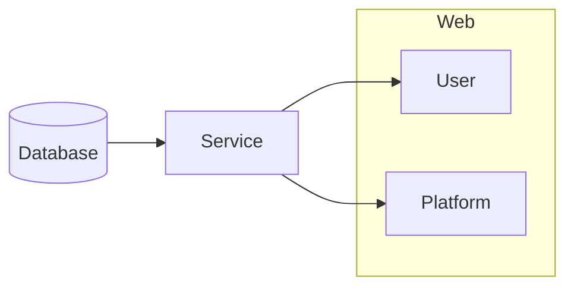
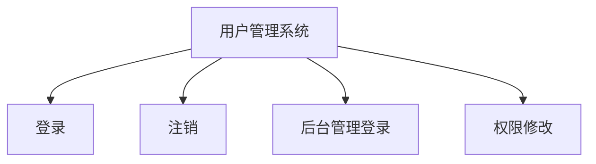
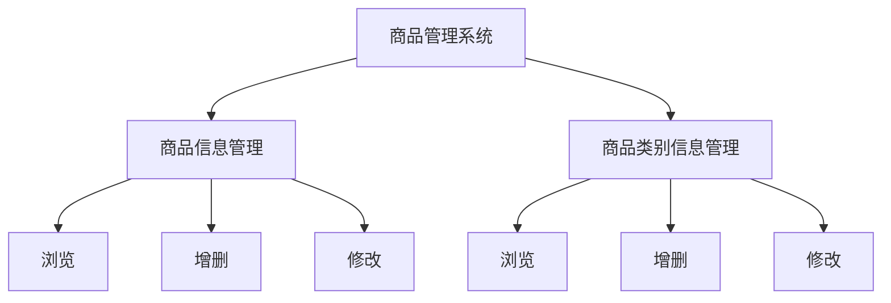
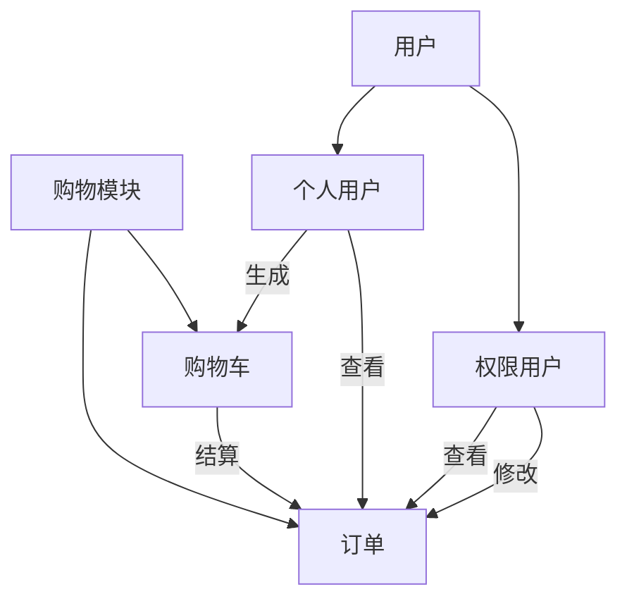

# 《网络应用开发》系统设计报告

[TOC]

## 1. 设计标准

### 1.1 系统功能

本系统为一个现代电子商务系统。主要提供给个人用户和电商平台使用，以实现网上商品的购买、订单追踪、平台管理、商品推荐等功能。通过本系统可以对相关的信息载体进行录入、变更、查找、审核等操作，按使用者的身份及任务划分权限让不同身份的用户明确自己的工作任务，同时也可以利用系统内置的修改身份权限设置来重组业务流程，以满足系统用户的需求。

### 1.2 系统效率

本系统采用基于Web的图形化页面进行操作，简单快捷，方便上手。同时在网络环境稳定的情况下可以高效率、高响应切正确地操作系统数据。

### 1.3 系统可靠性

本系统通过数据库模块的设计，使得数据可以正确地在数据库上进行修改。

### 1.4 系统可变更性

本系统结构简单，采用MVC和DAO组合的设计模式，利用Java面向对象的特性实现，各个组件之间分工明确互不干扰；对于系统功能的升级、添加和删除都可以通过修改或增加组件的方式实现，充分体现了系统的灵活性。

### 1.5 系统兼容性

本系统采用 Java8、Maven3.6 以及 Tomcat9 作为开发以及运行环境。支持在 Windows 和 Linux 系统下部署。

## 2. 平台设计

### 2.1 整体设计

本系统采用 MVC 架构进行设计，主要包含四个部分：数据库、服务端、电商平台客户端、个人用户客户端。客户端通过服务端对数据库进行访问，增加安全性。

层与层之间提供单向可调用的接口，使得不同层的业务在逻辑上独立开来，方便管理以及后续的扩展。

### 2.2 系统平台设计要求

- 易于上手；
- 容易进行扩展和维护；
- 操作简单，不需要额外的知识储备；
- 技术完善；

### 2.3 系统软件要求

- 使用VS Code作为开发工具；
- 使用MySQL8.0作为后台数据库管理系统；
- 使用Tomcat9.0作为服务器；
- 使用Maven3.6作为包管理；
- JDK8.0

## 3. 模块与模块内部功能规划

### 3.1 用户管理模块

用于管理用户信息和账户登录注销以及权限信息的模块。

### 3.2 商品管理模块

商品管理模块提供了后台权限用户对商品的管理。该模块主要包含了两个部分，分别是商品信息和商品类别信息，二者具有类似的功能。

### 3.3 购物模块

购物模块分为两个部分，一个是购物车部分，一个是订单部分。前者面向个人用户开放，后者部分功能面向个人用户开放，主要面向电商平台用户开放。

### 3.4 推荐模块

该模块通过针对用户的购买信息，根据算法生成推荐商品。

## 4. 数据库逻辑结构设计

以下为数据库的表设计，其中id为主键，是利用java的UUID工具生成的随机字符串。

- category(id, name, description)：商品类别对应的表
- goods(id, name, description, price, category_id)：商品对应的表
- user(id, name, password, email, address)：用户对应的表
- orders(id, time, state, total_price, user_id)：订单信息对应的表
- orderitem(id, goods_id, number, total_price, order_id)：订单日志对应的表
- manager(id, username)：权限用户对应的表
- logs(id, userid, goods_id, num)：购买记录对应的表
- correlation(id, goods1_id, goods2_id, correlation)：用于进行推荐的大数据对应的表

## 5. 推荐系统原理设计

本系统采用基于物品相关度的协同过滤算法进行推荐。通过维护物品间的相关度，对用户购买的物品信息进行分析，从而推荐相关的物品。

实现的过程中要考虑维护物品相关度的代价，尽可能快速的更新相关度信息，提高用户体验。同时也要考虑相关度评估的方式。
