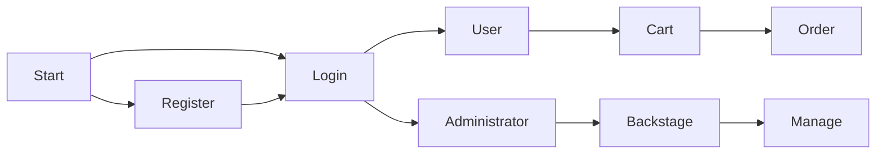
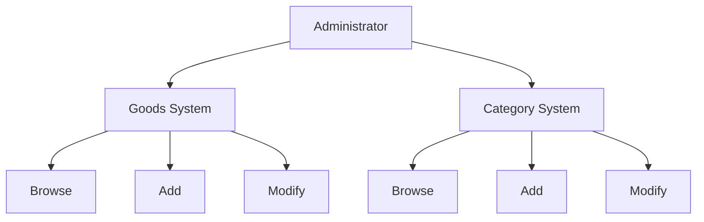
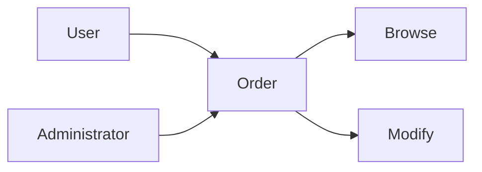
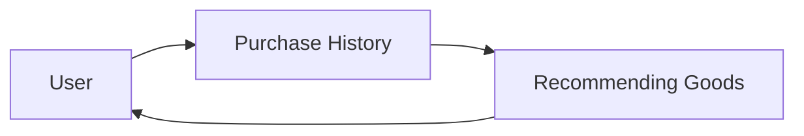
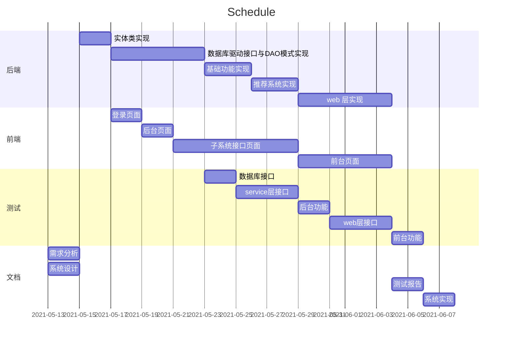

# 《网络应用开发》需求分析报告

[TOC]

## 1. 引言

### 1.1 编写目的

本项目为简易现代电子商务系统，同时能够满足基于大数据的数据分析模块。

本文档的为该系统的需求分析文档，目的是为了解决系统开发过程中的所需的需求分析。

### 1.2 项目背景

本项目为现代电子商务系统，它剧本有现代商业网站所必备的基于大数据的数据分析模块和推荐系统。

## 2. 需求概述

### 2.1 原始需求

- 基础功能
  - 使用角色对系统的登录、注册、注销；
  - 管理员角色对用户的浏览与修改；
  - 用户角色对商品的浏览、查询、购买以及订单的生成；
  - 销售人员对商品、以及商品类别的管理，对订单的修改和浏览；
- 大数据与推荐系统模块
  - 用户对商品购买的记录；
  - 日志文件的生成与操作；
  - 对用户购买趋势的预测；
  - 向用户推送推荐的商品；

### 2.2 用户特点

本系统的用户为个人和电商平台。

- 个人用户通过本系统可以浏览、购买商品，并查询订单信息；
- 电商平台通过本系统可以建立一个面向用户的网上销售渠道、一个统一组织的商品管理系统，并通过系统的推荐模块预测用户的需求。

### 2.3 系统目的

该系统的目的在于：

- 对于个人用户，在满足电商业务的基本需求，如购买、浏览等功能外，利用推荐系统提高个人用户购买和浏览时的用户体验；
- 对于电商平台，在满足电商业务的基本需求，如管理商品信息、管理用户与订单信息外，利用推荐系统最大程度地提高销售量，并留住用户。

## 3. 分析场景

### 3.1 用户系统

#### 3.1.1 系统分析

1. 用户在操作系统前需要进行登录，向登录接口提供用户名和密码；
2. 若用户不存在账号，则需要通过注册接口；
3. 对于登录后的个人用户，开放购买、结算生成购物车的权限；
4. 对于登录后的非个人用户可以通过后台接口进入后台管理系统；
5. 对于权限用户，在基础权限上，提供对所有用户的修改权限；
6. 对于权限用户，提供对商品相关信息的修改权限；

#### 3.1.2 业务流程图

### 3.2 商品系统

#### 3.2.1 系统分析

1. 对于权限用户，提供商品的查看、添加、修改功能；
2. 对于权限用户，提供商品列表的查看、添加、修改功能；

#### 3.2.2 业务流程图

### 3.3 订单系统

#### 3.3.1 系统分析

1. 对于个人用户，提供对自己订单的查询的接口，包括历史订单；
2. 对于权限用户，提供对所有订单的查询、修改接口；

#### 3.3.2 业务流程图

### 3.4 推荐系统

#### 3.4.1 系统分析

1. 对于个人用户，收集其购买信息；
2. 根据购买信息建立数据分析模块；
3. 根据数据分析模块的结论，对个人用户提供商品推荐；

#### 3.4.2 业务流程图

## 4. 功能实例化

### 4.1 登录注册模块

#### 4.1.1 子模块功能描述

- 对于登录部分，根据用户提供的账户信息进行查询，返回相关的信息，如登录成功的挑战、登录失败的提示等；
- 对于注册模块，根据用户提供的注册信息进行查询，返回相关的信息，如注册成功的挑战、用户名重复的提示等；

#### 4.1.2 子模块验收准则

- 正常实现上述功能，响应时间小于 100ms；

### 4.2 商品购买模块

#### 4.2.1 子模块功能描述

- 个人用户可以通过浏览商品信息对商品进行添加至购物车的操作，支持重复购买；
- 个人用户可以通过购物车接口查看购物车，支持结算生成订单的操作；
- 个人用户可以通过查看订单接口，查看已完成和未完的订单信息；

#### 4.2.2 子模块验收准则

- 正常实现上述功能，响应时间小于 100ms；

### 4.3 商品管理模块

#### 4.3.1 子模块功能描述

- 权限用户可以通过商品信息查询接口查询全部商品信息；
- 权限用户可以通过类别信息查询接口查询全部类别信息；
- 权限用户可以通过商品信息添加接口添加任意符合格式的商品信息；
- 权限用户可以通过类别信息添加接口添加任意符合格式的类别信息；
- 权限用户可以通过商品信息修改接口修改系统中的商品信息；
- 权限用户可以通过类别信息修改接口修改系统中的类别信息；
- 权限用户可以通过订单查询接口查询系统中的订单信息；
- 权限用户可以通过订单修改接口修改系统中的订单信息；

#### 4.3.2 子模块验收准则

- 正常实现上述功能，响应时间小于 100ms；
- 针对网络不稳定等突发情况，数据库能够保证操作结果的正确性；

### 4.4 用户管理模块

#### 4.4.1 子模块功能描述

- 权限用户可以通过用户查看接口查询系统中所有权限小于等于自己的用户信息；
- 高级权限用户可以通过用户修改接口修改系统中所有权限小于自己的用户信息；

#### 4.4.2 子模块验收准则

- 正常实现上述功能，响应时间小于 100ms；
- 针对网络不稳定等突发情况，数据库能够保证操作结果的正确性；

### 4.5 大数据与推荐模块

#### 4.5.1 子模块功能描述

- 对于个人用户，收集数据分析所需要的信息；
- 对于个人用户，根据其相关的数据进行分析，推荐可能需要的商品；

#### 4.5.2 子模块验收准则

- 对于不同行为的用户，体现出推荐系统行为的不同；
- 准确记录相关用户行为日志，从数据分析的角度合理地进行推荐；

## 5. 时间安排和其他

系统实现的重点应放在大数据与推荐模块的算法设计与分析上。

